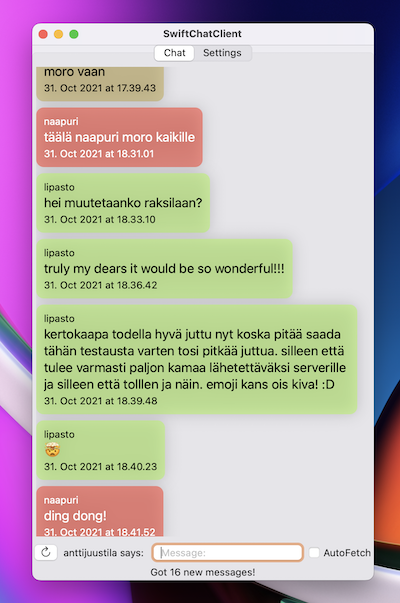

#  Swift Chat Client

This is a demonstration chat client app build with Swift and SwiftUI.

This client app works with a Java Chat Server app. This server was a topic for the course student project at 2021, in the course Programming 3, at the Study Program of Information Processing Science, University of Oulu, Finland.

 

Obviously you cannot use this client app without a functioning server to do anything useful. I may publish the Java HTTP chat server app at some point in the future.

The app connects to the server, logs the user in (if already registered) and then you can chat with all the connected clients/users. HTTP request and response payloads are JSON data structures, corresponding to the `User` and `ChatMessage` Codable structs. Using this information and studying the HTTP headers used in `ChatHttpClient`, you could implement a compatible server.

There is also a [Java console chat client](https://github.com/anttijuu/O3-chat-client), having unit tests to test the server students were supposed to implement in the course.

**NB 1:** The client connects using HTTP (no HTTPS) assuming server is at the local host with this demo setup. You can change the server URL in the Settings view though.

**NB 2:** In the course, students used self signed certificates on the server side to make things easier for them to work with HTTPS. If you would happen to have a real signed certificate with the server, you'd change the URL from `http` to `https` (couldn't get self-signed certs to work with `URLSession`). There is also an App Transport Security Exception in the project settings for a local network IP address so that the client could connect to that host with the server running there, in my home network, for demonstration purposes.

# About

(c) Antti Juustila, 2021-2022 All Rights reserved.
MIT License, see LICENSE for details.

